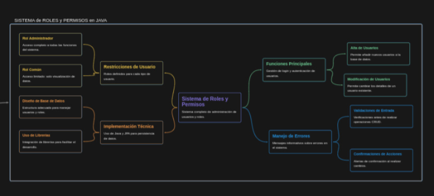

# Sistema de Roles y Permisos en Java
Este proyecto implementa un sistema completo de administración de usuarios y roles utilizando Java, JPA y una base de datos. El sistema permite el manejo de usuarios con diferentes roles, incluyendo la creación, modificación, eliminación y visualización de usuarios.

## Funciones Principales
-  Gestión de Login: Sistema para autenticar usuarios.
-  Alta de Usuarios: Posibilidad de añadir nuevos usuarios a la base de datos.
-   Modificación de Usuarios: Permite cambiar los detalles de un usuario existente.
-  Eliminación de Usuarios: Eliminación segura de usuarios de la base de datos.
- Visualización de Usuarios: Los usuarios pueden ser listados y gestionados.
## Roles y Permisos
- Rol Administrador:Acceso completo a todas las funciones del sistema, incluyendo la creación y eliminación de usuarios.
-  Rol Común:Acceso limitado, sólo puede visualizar datos.
## Implementación Técnica
- Lenguaje: Java
-  ORM: JPA (Java Persistence API)
-  Base de Datos: Utiliza una base de datos SQL para almacenar información de usuario y roles.
## Estructura de la Base de Datos
Se implementa una estructura de base de datos para gestionar usuarios y roles, asegurando que se manejen correctamente las relaciones y restricciones.
## Uso
Este proyecto está destinado para desarrolladores que deseen implementar un sistema de autenticación y gestión de usuarios utilizando Java. Para comenzar, asegúrate de tener configurado tu entorno de desarrollo y las dependencias necesarias.
## Instalación
1. Clona el repositorio en tu máquina local.
2. Configura tu base de datos y ajusta la conexión en el código.
3. Ejecuta el proyecto desde tu IDE favorito.
## Contribuciones
Las contribuciones son bienvenidas. Si deseas colaborar, por favor abre un issue o envía un pull request.
## Contacto
Para consultas o información adicional, puedes contactar a los desarrolladores:
Mauro Jesús Heinrich
<h3 align="left">Conéctate conmigo:</h3>

  
  
  
  
  
  
  

Si hay algún dato específico que quieras incluir o modificar, házmelo saber y puedo ajustarlo.
